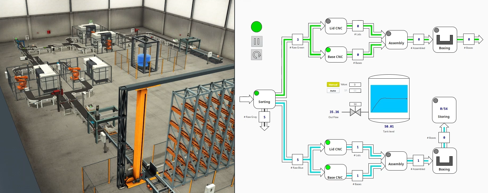

# Smart Factory Line: Simulation-Based Design and Implementation with an OPC-enabled HMI

  
  <em>Smart factory simulation using Factory I/O (left) and Ignition HMI (right)</em>
    

## 🎯 Overview  
his project simulates a fully automated smart factory line using **Factory IO** and **Siemens PLCs**, strictly adhering to modern industrial automation principles. The production system is modular, adaptive, and equipped with a custom **HMI built in Ignition Platform**, communicating through the **OPC DA** protocol.

## 🎥 Demo Video  
Watch a time-lapse demo of the system, showing the Factory IO plant and HMI interface side by side:  
[🔗 Watch the Video](https://www.youtube.com/watch?v=jPaWf-pehfE)

---

## ⚙️ System Architecture  

### Control Logic (TIA Portal)
- Developed using **Ladder Programming**
- Each module (e.g., sorting, assembly, boxing) coded independently
- A central **System Manager** coordinates all modules
- I/O used: 39 DI, 43 DQ, 10 AI, and 23 AQ (115 in total)

### Simulated Plant (Factory IO)
- **8 Robotic Arms**:
  - 4 for CNC operations
  - 2 for assembly
  - 2 for boxing
- **Sorting Unit**:
  - Automatically detects and sorts raw materials
  - Distributes valid materials to corresponding CNC lines
- **Storage System**:
  - Final boxed blue products are stored in a warehouse with a capacity of up to **54 boxes**
- **Continuous Water Tank**:
  - Controlled via **IMC (Internal Model Control)** strategy
  - Includes manual valve control, level setpoint input, high/low level alarms, and auto-recovery functionality

### Production Workflow
- **Three types** of raw materials: Green, Blue, Gray (randomly introduced)
- **Sorting**: Gray materials are discarded, Blue and Green are directed to their respective lines
- **Manufacturing**:
  - Lid and base are produced
  - Assembled into final products
  - Grouped into boxes (3 per box)
- **Dispatching**:
  - Green products are shipped
  - Blue products are stored
- The system is **adaptive** and regulates raw material input based on the current load

---

## 🖥️ HMI Features (Ignition Platform)
- Developed using:
  - **Ignition Server** – hosts the project and manages device communication
  - **Designer Launcher** – used to design the HMI via the Vision Module
  - **Vision Client Launcher** – runs the HMI in real-time on client machines
- Connected via **KEPServerEX** OPC DA server
- Displays real-time status for:
  - Sorting, CNC, Assembly, Boxing, Storage, and Tank
- Interactive features:
  - Plant **Pause / Reset**
  - **Setpoint input** for tank level
  - **Manual control** of tank inlet/outlet valves
  - Live counters of inputs/outputs per module
  - Status of in-process boxes and storage space
  - **Alarms** for high/low tank levels with **automatic override**

- Tags used in HMI: **37**

---

## 📁 Documentation & Resources
- 📄 [Ladder Logic PDF Files](./TIA Portal PLC Code/Code PDF)
- 📄 [I/O Configuration & Tag Descriptions](./TIA Portal PLC Code/Tags PDF)
- 📄 [OPC Tags](./KEPServerEX OPC Server/tags.csv)

---

## 💻 Software Stack  

> ⚠️ Versions used in development — compatible alternatives may work.

| Software         | Version     |
|------------------|-------------|
| TIA Portal       | v15.1       |
| Factory IO       | v2.4.3      |
| NetToPLCsim      | v1.2.5.0    |
| KEPServerEX      | v6.6        |
| Ignition Platform| v8.1.48     |

---

## 🚀 How to Run the System

1. **Launch TIA Portal**, load the project, and start simulation using **PLCSim**
2. Open **Factory IO** and connect it to **PLCSim**
3. Start **NetToPLCsim** and bind it to a pre-configured loopback IP  
   - Example: `10.0.0.40` for PLC, `10.0.0.50` for NetToPLCsim (same subnet)
4. Run **KEPServerEX** and ensure OPC tags are receiving data from the PLC
5. Start **Ignition Server**, configure OPC connections, and import tag structure
6. Launch the HMI with **Vision Client Launcher**

---

## 📌 Notes
- This project simulates a fully functional **smart factory** with **modular, adaptive automation**
- The entire system runs **autonomously**, from raw material entry to product dispatch
- Designed to mimic **real-world industrial setups** using widely used industrial protocols such as OPC DA
---
